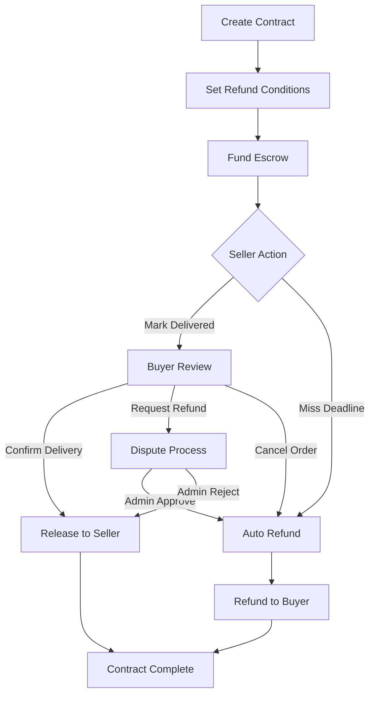

# Conditional Refund Smart Contract

A comprehensive conditional refund system built with Rust and the Soroban SDK for Stellar blockchain. This smart contract enables secure escrow services for marketplace transactions with automated refund capabilities, fostering trust between buyers and sellers through transparent condition-based fund management.

## 🌟 Features

### 🔒 Secure Escrow System
- **Fund Locking**: Buyer funds securely locked in escrow until conditions are met
- **Conditional Release**: Automatic fund release based on delivery confirmation or refund triggers
- **Real Token Transfers**: Integration with Stellar token contracts for actual asset transfers

### ⏰ Conditional Logic
- **Deadline Management**: Automatic refunds when delivery deadlines are exceeded
- **Cancellation Support**: Buyer can cancel orders before delivery for automatic refunds
- **Flexible Conditions**: Custom refund conditions defined per contract

### ⚖️ Dispute Resolution
- **Manual Refund Requests**: Either party can request refunds with documented reasons
- **Admin Arbitration**: Neutral admin can resolve disputes between buyers and sellers
- **Fair Resolution**: Disputed funds released to appropriate party based on admin decision

### 🔐 Security & Authorization
- **Role-Based Access**: Strict permissions for buyers, sellers, and admins
- **Authentication Required**: All operations require proper address authentication
- **State Protection**: Contract state validation prevents invalid operations

### 📈 Transparency & Tracking
- **Comprehensive Events**: Full audit trail of all contract activities
- **Status Monitoring**: Real-time tracking of contract lifecycle and fund movements
- **Query Functions**: Retrieve contract details and user transaction history

## 🏗️ Architecture

### File Structure
```
src/
├── lib.rs                 # Main contract interface
├── contract.rs            # Core business logic
├── error.rs              # Error definitions
├── events.rs             # Event system
├── storage.rs            # Admin storage utilities
├── refund_storage.rs     # Contract data structures & storage
└── test.rs              # Comprehensive test suite
```

## 🚀 Getting Started

### Prerequisites
- Rust 1.70+
- Soroban CLI
- Stellar account with testnet tokens

### Installation

1. **Clone the repository**
   ```bash
   git clone https://github.com/your-repo/conditional-refund-contract
   cd conditional-refund-contract
   ```

2. **Build the contract**
   ```bash
   cargo build --target wasm32-unknown-unknown --release
   ```

3. **Deploy to Stellar**
   ```bash
   soroban contract deploy \
     --wasm target/wasm32-unknown-unknown/release/conditional_refund.wasm \
     --source your-account \
     --network testnet
   ```

## 📖 Usage

### 1. Initialize Contract
```rust
// Initialize with admin address
contract.initialize(env, admin_address)
```

### 2. Create Refund Contract
```rust
let contract_id = contract.create_refund_contract(
    env,
    buyer_address,
    seller_address,
    token_address,
    1000_0000000, // 1000 tokens (with decimals)
    current_time + 86400 * 7,  // 7 days refund deadline
    current_time + 86400 * 3,  // 3 days delivery deadline
    "Digital product delivery with 48h refund policy".into(),
)?;
```

### 3. Fund the Contract
```rust
// Buyer funds the escrow
contract.fund_contract(env, contract_id, buyer_address)?;
```

### 4. Normal Transaction Flow
```rust
// Seller marks order as delivered
contract.mark_delivered(env, contract_id, seller_address)?;

// Buyer confirms delivery (releases funds to seller)
contract.confirm_delivery(env, contract_id, buyer_address)?;
```

### 5. Handle Refunds
```rust
// Request manual refund
contract.request_refund(
    env,
    contract_id,
    buyer_address,
    "Product not as described".into(),
)?;

// Process automatic refund (if conditions met)
contract.process_automatic_refund(env, contract_id)?;

// Admin resolves dispute
contract.resolve_refund_dispute(
    env,
    contract_id,
    admin_address,
    true, // approve refund
)?;
```

### 6. Contract Cancellation
```rust
// Cancel contract before delivery (automatic refund)
contract.cancel_contract(env, contract_id, buyer_address)?;
```

## 🔄 Contract Workflow



## 📊 Contract States

| Status | Description | Available Actions |
|--------|-------------|-------------------|
| **Created** | Contract initialized but not funded | Fund, Cancel |
| **Funded** | Buyer deposited funds in escrow | Mark Delivered, Request Refund, Cancel |
| **Delivered** | Seller marked order as delivered | Confirm Delivery, Request Refund |
| **Completed** | Buyer confirmed, funds released to seller | View Only |
| **RefundRequested** | Refund requested, awaiting resolution | Admin Resolution |
| **RefundProcessed** | Refund completed to buyer | View Only |
| **Cancelled** | Contract cancelled, funds returned | View Only |

## 🔧 Automatic Refund Triggers

The contract automatically processes refunds when:

1. **⏰ Delivery Deadline Exceeded**: Seller fails to deliver within specified timeframe
2. **🔄 Buyer Cancellation**: Buyer requests refund before delivery is marked
3. **⚖️ Admin Approval**: Dispute resolved in favor of the buyer


## 🛡️ Security Features

- **Authorization Checks**: All functions require proper authentication via `require_auth()`
- **State Validation**: Strict state machine prevents invalid transitions
- **Deadline Enforcement**: Time-based conditions are strictly enforced
- **Fund Protection**: Escrowed funds protected from unauthorized access
- **Admin Controls**: Sensitive dispute resolution requires admin privileges


## 🚀 Deployment

1. **Build for production**
   ```bash
   cargo build --target wasm32-unknown-unknown --release --profile release-with-debug
   ```

2. **Deploy to Stellar**
   ```bash
   soroban contract deploy \
     --wasm target/wasm32-unknown-unknown/release/conditional_refund_contract.wasm \
     --source your-deployer-account \
     --network mainnet
   ```

3. **Initialize contract**
   ```bash
   soroban contract invoke \
     --id YOUR_CONTRACT_ID \
     --source your-admin-account \
     --network mainnet \
     -- initialize \
     --admin YOUR_ADMIN_ADDRESS
   ```
