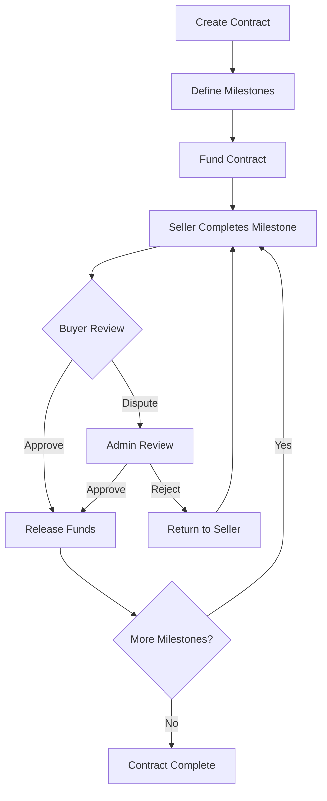

# Milestone-Based Payment Smart Contract

A comprehensive milestone-based payment system built with Rust and the Soroban SDK for Stellar blockchain. This smart contract enables secure, incremental payments tied to project milestones, fostering trust between buyers and sellers in marketplace environments.

## 🌟 Features

### 🔒 Secure Escrow System
- **Total Payment Locking**: Full payment amount locked in escrow at contract creation
- **Incremental Release**: Funds released only upon milestone completion and approval
- **Real Token Transfers**: Integration with Stellar token contracts for actual asset transfers

### 📊 Milestone Management
- **Flexible Milestone Creation**: Define custom milestones with descriptions and release criteria
- **Status Tracking**: Complete milestone lifecycle (Pending → Completed → Approved)
- **Amount Validation**: Ensures milestone amounts sum to total contract value

### ⚖️ Dispute Resolution
- **Dispute System**: Buyers can challenge completed milestones
- **Admin Resolution**: Neutral admin can resolve disputes fairly
- **Fund Protection**: Disputed funds remain in escrow until resolution

### 🔐 Security & Authorization
- **Role-Based Access**: Strict permissions for buyers, sellers, and admins
- **Address Verification**: All operations require proper authentication
- **State Validation**: Contract state checks prevent invalid operations

### 📈 Transparency & Tracking
- **Comprehensive Events**: Full audit trail of all contract activities
- **Real-time Updates**: Track milestone progress and fund movements
- **Query Functions**: Retrieve contract and milestone details

## 🏗️ Architecture

### File Structure
```
src/
├── lib.rs                  # Main contract interface
├── contract.rs             # Core business logic
├── error.rs               # Error definitions
├── events.rs              # Event system
├── storage.rs             # Basic storage utilities
├── milestone_storage.rs   # Data structures & storage
└── test.rs               # Test module
```

## 🚀 Getting Started

### Prerequisites
- Rust 1.70+
- Soroban CLI
- Stellar account with testnet tokens

### Installation

1. **Clone the repository**
   ```bash
   git clone https://github.com/your-repo/milestone-payment
   cd milestone-payment
   ```

2. **Build the contract**
   ```bash
   cargo build --target wasm32-unknown-unknown --release
   ```

3. **Deploy to Stellar**
   ```bash
   soroban contract deploy \
     --wasm target/wasm32-unknown-unknown/release/milestone_payment.wasm \
     --source your-account \
     --network testnet
   ```

## 📖 Usage

### 1. Initialize Contract
```rust
// Initialize with admin address
contract.initialize(env, admin_address)
```

### 2. Create Milestone Contract
```rust
let milestones = vec![
    MilestoneData {
        description: "Initial Setup".into(),
        amount: 1000,
        release_criteria: "Setup completed".into(),
    },
    MilestoneData {
        description: "Final Delivery".into(),
        amount: 2000,
        release_criteria: "Project delivered".into(),
    },
];

let contract_id = contract.create_contract(
    env,
    buyer_address,
    seller_address,
    token_address,
    3000, // total amount
    milestones,
)?;
```

### 3. Fund the Contract
```rust
// Buyer funds the contract
contract.fund_contract(env, contract_id, buyer_address)?;
```

### 4. Complete Milestones
```rust
// Seller marks milestone as completed
contract.complete_milestone(env, contract_id, 0, seller_address)?;

// Buyer approves milestone (releases funds)
contract.approve_milestone(env, contract_id, 0, buyer_address)?;
```

### 5. Handle Disputes
```rust
// Buyer disputes a milestone
contract.dispute_milestone(
    env,
    contract_id,
    0,
    buyer_address,
    "Work not meeting requirements".into(),
)?;

// Admin resolves dispute
contract.resolve_dispute(env, contract_id, 0, admin_address, true)?;
```

## 🔄 Contract Workflow


